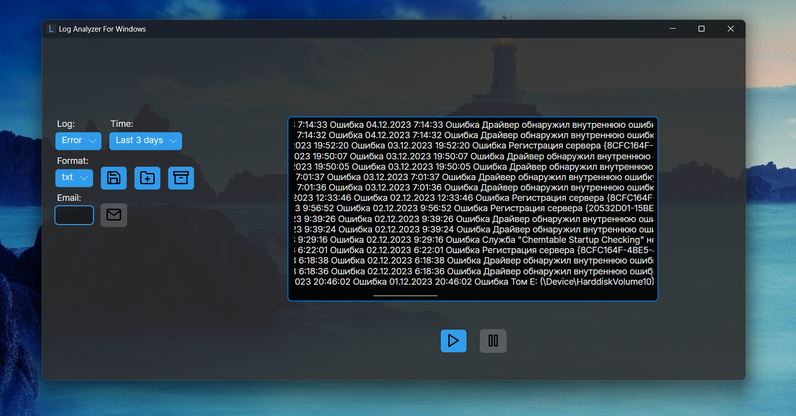

# Log Analyzer for Windows

This project is a log analyzer for Windows, which reads system logs, filters them based on the selected log level and time interval, and displays the results in a user-friendly format. The application also provides features to save the logs in different formats (txt, json), archive the logs, and send the logs via email.

## Features

- Read system logs
- Filter logs based on log level and time interval
- Display logs in a user-friendly format
- Save logs in txt or json format
- Archive logs
- Send logs via email

## Requirements

- The primary language of the operating system must be either English or Russian for the application to work correctly.

## Usage

1. To install the LogAnalyzerForWindows application, download the LogAnalyzerForWindows.rar (if primary language of the operating system is Russian) OR LogAnalyzerForWindowsEN.rar (if primary language of the operating system is English). Extract the .rar file, and run the LogAnalyzerForWindows.exe file on your machine.

## Contributing

Pull requests are welcome. For major changes, please open an issue first to discuss what you would like to change.

## Author

Bohdan Harabadzhyu

## License

[MIT](https://choosealicense.com/licenses/mit/)

Please note that this project is released with a Contributor Code of Conduct. By participating in this project you agree to abide by its terms.

## SourceForge

