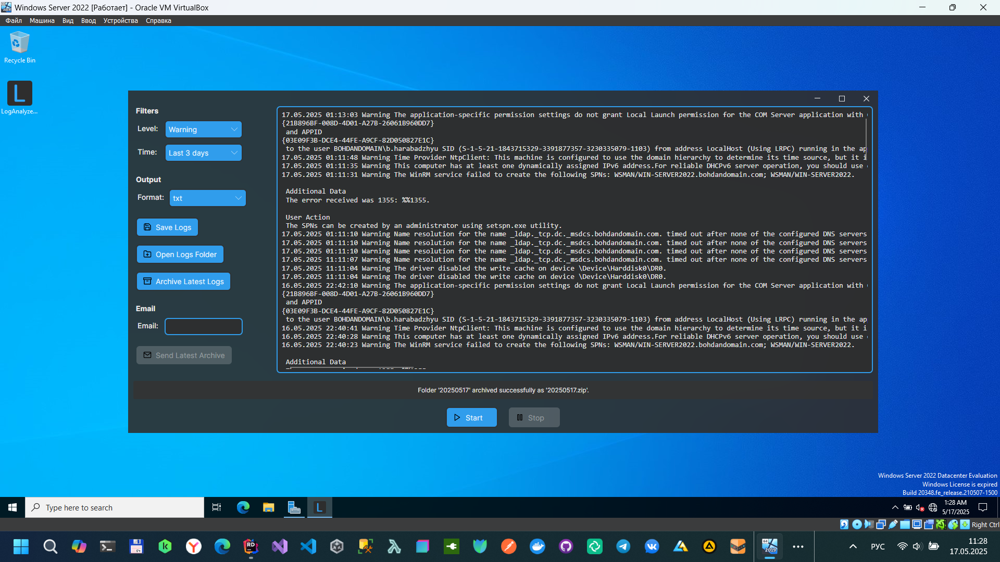

# AzioEventLog Analyzer

AzioEventLog Analyzer is a monitoring and analysis tool with real-time tracking, database storage, advanced filtering capabilities, and interactive dashboard visualization.

## Features

### **Dual Operation Modes**
- **Real-time Monitoring Mode**: Continuously monitor Windows Event Logs with automatic updates
- **Database Mode**: View and analyze historical logs with pagination and session-based filtering

### **Interactive Dashboard**
- **Summary Cards**: Quick overview of total logs, errors, warnings, and information events
- **Pie Chart**: Visual distribution of log levels
- **Timeline Chart**: Events over time with zoom capability
- **Top Sources Chart**: Bar chart showing most active event sources
- **Top Event IDs Chart**: Horizontal bar chart of most frequent event IDs
- **Session Filtering**: Filter dashboard data by monitoring session
- **Auto-refresh**: Dashboard updates when switching sessions

### **Advanced Filtering**
- Filter by log source (System, Application, Security, etc.)
- Filter by log level (Error, Warning, Information, AuditSuccess, AuditFailure)
- Time-based filtering (Last hour, 24 hours, 3 days, 7 days)
- Session-based filtering for historical data
- Search in messages
- Filter by Event ID
- Filter by Source

### **Data Management**
- Save logs in multiple formats (TXT, JSON)
- Persistent SQLite database for log history
- Session tracking with unique identifiers
- Clear all history with one click

### **Email Integration**
- Send log archives via email
- SMTP configuration through settings
- Archive latest logs folder to ZIP

### **Technical Features**
- Built with Avalonia UI for cross-platform compatibility
- LiveChartsCore for interactive data visualization
- Asynchronous operations for responsive UI
- Batch processing for large log volumes
- Efficient memory management with pagination
- Error handling and user feedback
- FileSystemWatcher for folder monitoring
- WMI (Windows Management Instrumentation) integration
- Entity Framework Core with SQLite

## Requirements

- **Operating System**: Windows (tested on Windows 10/11)
- **System Language**: English, Russian, or any language with numeric event types
- **.NET**: .NET 9.0
- **Administrator Rights**: Required for reading certain event logs (Security log)

## Usage

### Real-time Monitoring
1. Select a **Log Source** (e.g., System, Application)
2. Choose a **Log Level** to monitor (e.g., Error, Warning)
3. Set a **Time Range** (e.g., Last 24 hours)
4. Click **Start** to begin monitoring
5. View logs in real-time in the output window
6. Click **Stop** to end monitoring
7. Click **Save Logs** to export the current session

### Database Mode
1. Toggle **Database Mode** to view historical logs
2. Select a **Session** from the dropdown
3. Use **Search** to find specific messages
4. Filter by **Event ID** or **Source**
5. Navigate through pages using pagination controls
6. Adjust **items per page** for comfortable viewing
7. Click **Export Session** to save all logs from a session
8. Use **Clear All History** to delete all stored logs

### Dashboard
1. Switch to the **Dashboard** tab
2. View summary cards with key metrics
3. Analyze log distribution with the pie chart
4. Track event frequency over time with the timeline
5. Identify top event sources and IDs
6. Select a session to filter dashboard data
7. Click **Refresh** to update charts

## Contributing

Pull requests are welcome. For major changes, please open an issue first to discuss what you would like to change.

## Author

Bohdan Harabadzhyu

## License

This project is licensed under the MIT License - see the [LICENSE](LICENSE) file for details.

## SourceForge

